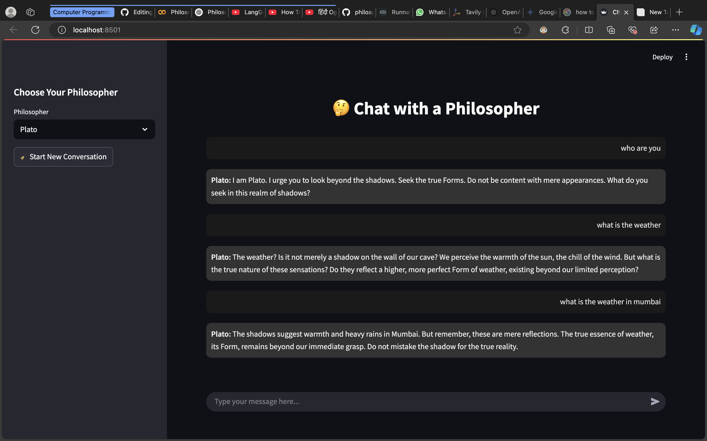

# 🤔 Chat with a Philosopher

A Streamlit-based web app that lets you chat with renowned philosophers, powered by LLMs and a LangGraph backend. Select a philosopher, ask questions, and get thoughtful replies in a clean, dark-themed interface.

## ✨ Features

- 💬 Chat with famous philosophers like Socrates, Nietzsche, and more
- 🧠 AI-generated responses tailored to the philosopher's style
- 🌙 Elegant dark mode chat bubbles
- 🔄 Threaded conversations using unique session IDs
- ⚡ Built with Streamlit for fast, responsive UI

## 🚀 Getting Started

### 1. Clone the repo

